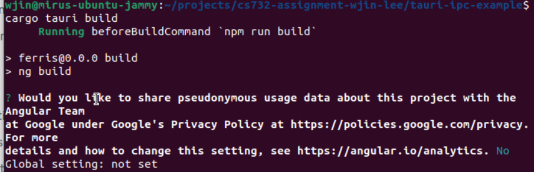

# ASIST
This is an application meant to automate the perception-transcription test protocol for part IV project #37. 

## Setup
1. Install Node.JS version `>= 20` from https://nodejs.org/en/download \
   _(not guaranteed to work with other versions!)_

2. Clone this repository.
```bash
git clone https://github.com/wjin-lee/piv-intelligibility-tester.git
```
3. Install the npm dependencies
```bash
npm install
```

4. Install Tauri dependencies by following the instructions for your operating system at https://v2.tauri.app/start/prerequisites/
> NOTE 1: Opt for the standard Rust installation.

> NOTE 2: Ensure your terminal can access the newly installed Rust binaries. (Check if `cargo` outputs help text.) If your terminal cannot find the installed Rust binaries, try restarting your terminal or computer.

5. Install the Tauri CLI
> NOTE: At the time of writing, Tauri 2.0 is in beta with the release candidate being available. In the future, this should be updated to the 2.0 stable release.
 ```bash
cargo install tauri-cli@^2.0.0-rc
```

## Development Server
During development, run the following command to test your app and get live reloading.

```bash
cargo tauri dev
```

If this is the first time you are using the Angular CLI, you may be prompted with the following message:

You must give an answer to the question before tauri can start. In some cases, this message may not correctly display. If that is the case, please try `npm run start` manually, then ensure it can run before running `cargo tauri dev` again.

If you get the following error, you probably forgot to `npm install` in that folder.


## Compiling the Binary
To compile the project to a binary, run the following command from the respective folder. 
```bash
cargo tauri build
```

If you get the following error, you probably forgot to `npm install` in that folder.


After the build finishes, output directories for your current platform's setup files will be printed to console.

Alternatively, an executable can also be found in `./src-tauri/target/release`.

### Note on Cross-Platform Compilation
Because Tauri relies heavily on native toolchains for compilation, cross-compilation is not currently supported. I.e. to compile a MacOS binary, we must run `cargo tauri build` on the MacOS environment we are targetting. Same with Windows as well as Linux.

See the [Tauri docs](https://tauri.app/v1/guides/building/cross-platform/) for more on this.